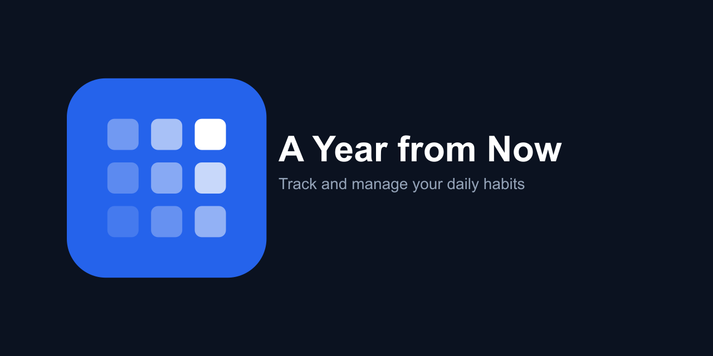

### A Year from Now

A habit-tracking application built with **Nuxt 3**, **Drizzle ORM**, and **SQLite**. Designed to help you set and achieve your daily goals while providing a clean and intuitive user experience.

---

### Features

- ✨ **Server-Side Rendering (SSR)** for optimized performance.
- 🔒 **GitHub Authentication** using [nuxt-auth-utils](https://github.com/atinux/nuxt-auth-utils).
- 🗂️ **Drizzle ORM** integrated with **SQLite** for efficient database management.
- 📅 **Calendar Heatmap** to visualize your progress.
- 📊 **Progress Tracker** with dynamic completion rates.
- 🌗 **Dark/Light Mode Toggle** with built-in support from [Nuxt UI](https://ui.nuxt.com).
- 🖊️ **Markdown Support** for habit descriptions.
- 🧩 Modular and scalable **component-based architecture**.
- 🚀 Seamless deployment with [NuxtHub](https://hub.nuxt.com).
- 🔄 **State Management** with [Pinia](https://pinia.vuejs.org).
- 🛠️ Enhanced developer experience with [Nuxt DevTools](https://devtools.nuxt.com).

---

### Credits

This project is a rebrand of [Habit Tracker](https://github.com/zackha/habit) by [Sefa Bulak](https://github.com/zackha), used and modified under the MIT License.

### License

This project is licensed under the [MIT License](./LICENSE).
